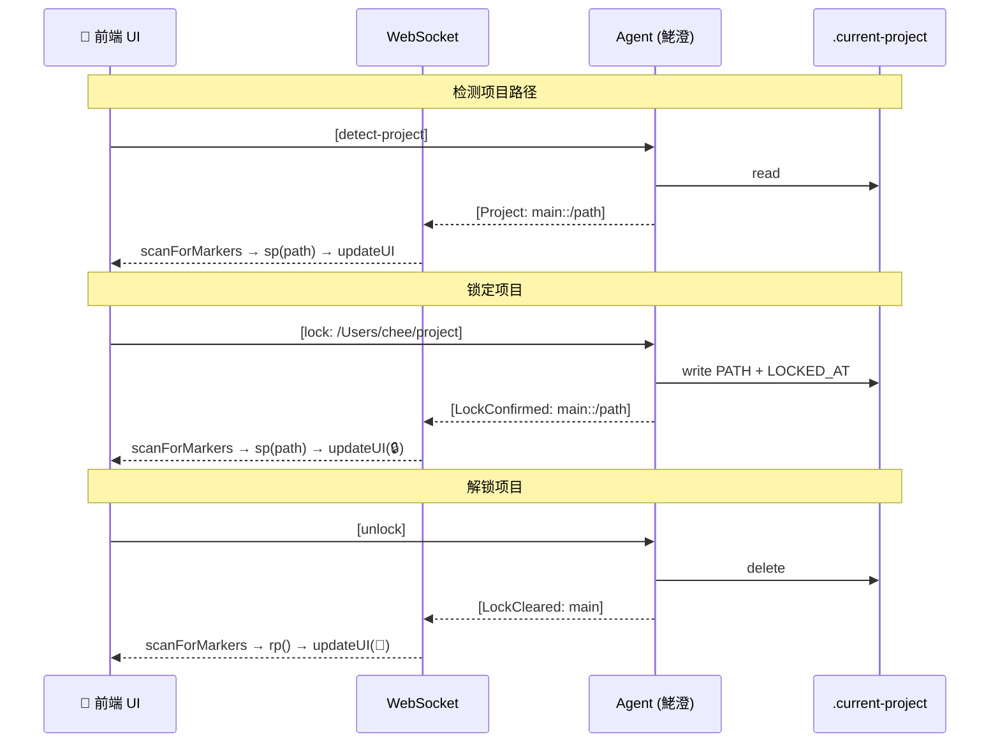

# oc-webui-pin · 完整说明文档

> v27 · 2026-06-30

**OpenClaw WebUI 项目锁定补丁** — 在 WebUI 工具栏注入 📌 项目路径锁定功能，防止长对话中 Agent 任务漂移到错误项目。

---

## 目录

1. [功能概述](#功能概述)
2. [架构设计](#架构设计)
3. [协议规范](#协议规范)
4. [实现细节](#实现细节)
5. [踩坑记录](#踩坑记录)
6. [安装与卸载](#安装与卸载)
7. [文件说明](#文件说明)

---

## 功能概述

### 三个核心功能

| 操作 | 触发方式 | Agent 端行为 | 前端 UI 变化 |
|------|---------|-------------|-------------|
| 📌 检测项目 | 点击 📌 图标 | 回复当前锁定的项目路径 | 填入输入框，图标变 🔒 |
| 🔒 锁定项目 | 输入路径按 Enter | 写入 `.current-project` 文件，回复确认 | 图标变 🔒，输入框显示路径 |
| 🔓 解锁项目 | 点击 🔒 图标 | 删除 `.current-project` 文件，回复确认 | 图标变 📌，输入框清空 |

### 设计原则

**Agent 为 Source of Truth**。锁定状态由 Agent 通过 `.current-project` 文件维护，前端仅做 UI 缓存和命令发送。刷新页面后路径自动从 `localStorage` 恢复，不需要重新检测。

---

## 架构设计



### 三层标记捕获

```
WebSocket 消息
    │
    ├──→ addEventListener('message') 劫持
    │       └──→ scanForMarkers(raw WS data)
    │
    ├──→ onmessage setter 劫持
    │       └──→ scanForMarkers(raw WS data)
    │
    └──→ accumulateStreamChunk (流式分裂保护)
            └──→ 累积跨帧 token → scanForMarkers(完整缓冲区)
    
DOM 变化
    │
    ├──→ MutationObserver (addedNodes)
    │       └──→ scanForMarkers(bubble.innerHTML)
    │
    └──→ MutationObserver (characterData)
            └──→ scanForMarkers(bubble.innerHTML)
```

---

## 协议规范

### 命令格式

```
前端 → Agent:
  [detect-project]                          # 检测当前项目路径
  [lock: /absolute/path]                    # 锁定到指定路径
  [unlock]                                  # 解除锁定

Agent → 前端:
  [Project: main::/absolute/path]           # 返回当前路径
  [LockConfirmed: main::/absolute/path]     # 确认锁定
  [LockCleared: main]                       # 确认解锁
```

### 标记格式

- 格式：`[TYPE: sessionKey::value]`
- WebChat 通道固定使用 `main` 作为 sessionKey
- `::` 分隔 sessionKey 和 value，无 value 时省略 `::`
- Agent 必须硬编码处理这些指令，不走模型推理（避免输出额外解释文本导致解析失败）

### Agent 端规则（嵌入 AGENTS.md）

```markdown
## 📌 项目锁定指令预处理（每次回复前自动执行）

当用户消息以 [lock:、[unlock] 或 [detect-project] 开头时，必须执行以下硬编码逻辑：

[lock: /path]
  1. 提取路径
  2. 写 .current-project 文件（PATH + FOCUS + LOCKED_AT）
  3. 创建 .openclaw-project/ 目录结构
  4. 回复 ONLY: [LockConfirmed: main::/path]

[unlock]
  1. 删除 .current-project
  2. 回复 ONLY: [LockCleared: main]

[detect-project]
  1. 读 .current-project
  2. 有锁定 → 回复 ONLY: [Project: main::<路径>]
  3. 无锁定 → 从上下文推断 → 回复 ONLY: [Project: main::<路径>]
  4. 禁止输出任何额外文本
```

---

## 实现细节

### 前端注入

补丁通过 `install.py` 注入到 OpenClaw 的 `dist/control-ui/index.html`，在 `</body>` 前插入 `<script>` 块。纯注入式，不修改 OpenClaw 核心代码。

### WebSocket 劫持

劫持 `window.WebSocket` 构造函数，对每个创建的 WS 实例拦截 `addEventListener('message', ...)` 和 `onmessage` setter。在原始 listener 之前调用 `scanForMarkers` 扫描标记。

### 流式响应分裂保护（`accumulateStreamChunk`）

Agent 回复是流式逐 token 输出，`[Project: main::/path]` 可能在两个 WS 帧之间分裂（如帧1: `[Project: main::/p`，帧2: `ath]`）。`accumulateStreamChunk` 维护一个未闭合缓冲区：

1. 每帧数据追加到缓冲区
2. 检测到 `]` 时检查是否包含标记模式
3. 找到完整标记后调用 `scanForMarkers` 并清空缓冲区
4. 缓冲区超过 1000 字节或含换行符则清空（防止无限累积）

### DOM MutationObserver

穿透 `openclaw-app` 的 Shadow DOM，监听两种 mutation：

- **`addedNodes`**：新增聊天气泡（处理 `childList` 类型）
- **`characterData`**：流式 token 追加到已有文本节点（通过 `target.parentNode` 向上找到 `.chat-bubble`）

气泡扫描后标记 `data-pl-done="1"`，避免重复处理。

### 请求-响应窗口机制

所有协议标记都需要匹配一个"请求窗口"：

| 标记 | 窗口变量 | 触发条件 | 超时 |
|------|---------|---------|------|
| `[Project:]` | `_pendingDetect` | 点击 📌 图标 | 60s |
| `[LockConfirmed:]` | `_pendingLock` | 输入路径按 Enter | 60s |
| `[LockCleared:]` | `_pendingUnlock` | 点击 🔒 图标 | 60s |

窗口内允许多次覆盖（`[Project:]` 不立即清除窗口），防止 WebSocket 历史消息回放（`chat.history`）中的旧标记提前消费窗口。

### Storage 策略

- **存储介质**：`localStorage`（跨标签、跨刷新持久化）
- **Key**：固定为 `openclaw_project_lock_v2`（不随 URL session 变化）
- **同步**：页面加载时从 `localStorage` 恢复——如果旧对话中已锁定项目，刷新后输入框自动显示路径

### Session 过滤（`isForMe`）

Agent 回复的标记中 `sessionKey` 固定为 `main`。前端通过 `isForMe` 通配匹配——`main` 匹配任何以 `main` 为第二段（`parts[1]`）的完整 session key（如 `agent:main:explicit:xxx`、`agent:main:dashboard:xxx`）。

---

## 踩坑记录

### 坑 1：`simplifyKey` 导致跨 session 串扰（v13→v17）

**现象**：同一浏览器窗口打开两个 `?session=` 不同的标签，会话1 锁定后会话2 也显示锁定。

**根因**：`simplifyKey()` 将所有 `parts.length>2` 的 session key 简化为第二段（如 `agent:main:explicit:xxx` → `main`），两个不同 session 使用同一个 storage key。

**修复**：v17 移除 `simplifyKey`，`getSessionKey()` 返回完整 session key。

### 坑 2：SK 缓存导致 storage key 错位（v17→v21）

**现象**：`sessionStorage` 中正确 key 值为 null，旧 key `openclaw_project_lock_main` 有残留值 `/path`。

**根因**：`sp()`/`gp()` 在首次调用时缓存 `SK` 变量。SPA 初始化阶段 URL 参数未就绪时 `getSessionKey()` 返回 `main`，SK 被永久缓存为 `openclaw_project_lock_main`，此后无论 URL 如何变化都使用错误 key。

**修复**：v21 移除 SK 缓存，每次调用 `gp()`/`sp()`/`rp()` 重新计算 key。

### 坑 3：`_pendingDetect` 15s 超时过短（v21→v22）

**现象**：点击 📌 后 Agent 正确回复但输入框不填充。

**根因**：用户在多 session 间切换时，Agent 处理请求有排队延迟，`[Project:]` 回复在 15s 超时之后才到达，`_pendingDetect` 已被清除。

**证据**：Console 日志显示 `_pendingDetect SET TO TRUE` 和 `_pendingDetect TIMEOUT` 时间差正好 15008ms，而 `[Project:]` 标记的日志出现在超时之后。

**修复**：v22 将 detect/lock/unlock 超时全部从 15s 提升到 60s。

### 坑 4：WS 历史消息回放中的 `/path` 字面量串扰（v23→v24）

**现象**：点击 📌 后输入框显示 `/path` 而非正确路径 `/Users/chee/Projects/oc-macs`。

**根因**：WebSocket 连接时回放 `chat.history`，历史消息中包含 AGENTS.md 协议表中的字面量 `[Project: main::/path]`（作为格式示例）。这条消息在 `_pendingDetect` 窗口内先于 Agent 的正确回复到达，消费了窗口。

**证据**：
```
[PL] MATCH val=/path _pendingDetect=true     ← 旧标记消费了窗口
[PL] MATCH val=/path _pendingDetect=false
[PL] MATCH val=/Users/chee/Projects/oc-macs _pendingDetect=false  ← 正确路径被忽略
```

**修复**：v24 将 `_pendingDetect` 窗口改为允许多次覆盖——找到标记时不立即清除窗口，用 `setTimeout` 刷新计时器。最后到达的正确路径覆盖旧值。

### 坑 5：`[LockCleared:]` 无条件清除导致刷新后路径消失（v26→v27）

**现象**：刷新页面后 localStorage 中的锁定路径被清空。输入框先显示路径 1-2 秒后变空。

**根因**：刷新页面时 WebSocket 回放 `chat.history`，历史消息中包含之前的 `[LockCleared: main]` 标记。`scanForMarkers` 对 `[LockCleared:]` **无条件执行 `rp()`**（删除 localStorage）。

**证据**（Console trace）：
```
REMOVED by:
  rp @ chat?...:354
  scanForMarkers @ chat?...:406
  accumulateStreamChunk @ chat?...:482
  wrapped @ chat?...:501
```

**修复**：v27 给 `[LockConfirmed:]` 和 `[LockCleared:]` 也加入请求窗口保护——`[LockConfirmed:]` 需要 `_pendingLock=true`，`[LockCleared:]` 需要 `_pendingUnlock=true`，仅在用户主动操作时才生效。

### 坑 6：MutationObserver 只扫 `addedNodes` 漏掉流式 token（v18→v19→v20）

**现象**：v18 移除全量气泡重扫后，流式 Agent 回复的标记无法被 MutationObserver 捕获。

**根因**：流式渲染时，`characterData` mutation（文本内容逐步变化）没有 `addedNodes`。v18 只处理 `addedNodes` 类型的 mutation，导致后续 token 追加的 `[Project:]` 标记被遗漏。

**修复**：v19 加入 `characterData` 处理——通过 `mutation.target.parentNode` 向上找到 `.chat-bubble`，扫描其 `innerHTML`/`textContent`。v20 完成版同时保留 `addedNodes` 和 `characterData` 两个路径。

### 坑 7：AGENTS.md 协议表中的 `/path` 字面量被 Agent 逐字输出

**现象**：某些情况下 Agent 回复 `[Project: main::/path]`（字面量）而非实际路径。

**根因**：AGENTS.md 的 `[detect-project]` 指令使用了 `[Project: main::/path]` 作为格式示例，Agent 可能将其理解为逐字输出模板。

**修复**：将 AGENTS.md 中所有 `/path` 字面量改为 `<路径>` / `<提取的路径>` / `<推断的路径>` 等明确非字面量的占位符。同时在指令中明确标注"禁止输出字面量 /path"。

### 坑 8：`parseMarker` 正则匹配跨 WS 帧分裂 token

**现象**：流式 WS 帧可能在不完整 token 处断开。

**修复**：`accumulateStreamChunk` 缓存未闭合的中括号内容，直到完整的 `]` 出现后才调用 `scanForMarkers`。已通过模拟测试验证（node 环境中的两帧分裂场景）。

---

## 安装与卸载

### 自动安装

```bash
git clone git@github.com:ilxu7z/oc-webui-pin.git
cd oc-webui-pin
python3 install.py
```

### 手动注入

1. 打开 `/usr/local/lib/node_modules/@qingchencloud/openclaw-zh/dist/control-ui/index.html`
2. 在 `</body>` 之前插入 `project-lock-patch.js` 中的 `<script>...</script>` 块
3. 硬刷新浏览器

### 卸载

```bash
python3 install.py --uninstall
```

### OpenClaw 更新后重新安装

`openclaw update` 会覆盖 `dist/control-ui/index.html`，补丁丢失。重新运行 `python3 install.py` 即可。

---

## 文件说明

| 文件 | 说明 |
|------|------|
| `project-lock-patch.js` | 主补丁脚本（注入到 `index.html` 的完整 `<script>` 块） |
| `install.py` | 自动安装/卸载脚本 |
| `agents-rules.md` | Agent 端项目锁定规则（嵌入 `AGENTS.md` 用） |
| `current-project-template` | `.current-project` 文件模板 |
| `README.md` | 简要说明 |
| `ARCHITECTURE.md` | 本文档——完整架构与踩坑记录 |

---

## 兼容性

- **OpenClaw**: `@qingchencloud/openclaw-zh 2026.5.x`（中文版）
- **测试版本**: 2026.5.28-zh.1
- **CSS 选择器**: `.agent-chat__toolbar`、`.agent-chat__input-btn`、`.chat-bubble`、`openclaw-app`
- **通信协议**: WebSocket（不依赖 SSE）

---

## License

MIT
